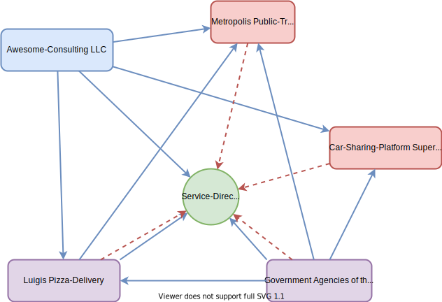

 
# Introduction to the EFS-Middleware

The **E**co**F**leet**S**ervices-Middleware is a pseudo-decentralized digital platform for offering and consuming mobility services. It is intended to provide a standardized API for searching and booking mobility services (if you are a consumer) as well as registering and providing such services (if you are a mobility service provider).

First of all, what is *the* middleware? What we call the middleware is not a particular software component that can be installed somewhere but rather it is a network of microservices that work together hand in hand to achieve the goal described above. *The* middleware is a network. It is the network between the consumers and providers that brings them together on the platform. It is totally valid to say that the middleware as a network also is the platform.

In the following picture you see a fictional middleware that connects various players together in one network making them able to communicate with each other:

The picture contains four rectangles with various colors and a green circle. They all represent actors in the middleware. **Red** means, this actor soley acts as a mobility service provider, that offers services to other actors. **Blue** means, the actor soleys acts as a mobility service consumer, consuming the services offered by the providers. **Purple** means, the actor both acts as a provider and a consumer. The **green** circle in the middle named **Service-Directory** has a special role.

This Service-Directory, as the name already suggests, serves as a registry for all mobility services that are offered by the providers within this middleware network. It provides an API for registering such services as well as for querying the registry. The consumers in the middleware use this API to search for mobility providers that match their needs.

If a provider joins the middleware-network it only needs to register it's mobility service at the Service-Directory to be discoverable for potential consumers (visualized by the red dashed arrows). Consumers query the Service-Directory as much as they need to find matching mobility providers and then contact those providers directly to communicate with them (visualized by the blue arrows).

This is the basic concept of the EFS-middleware.

## Multiple Middleware instances

While the ultimate goal of the EFS-project is to create a single decentralized platform for sharing mobility services with each other, this goal is not achievable in the context of this project, simply because it's too complex and huge to tackle it at once.

Therefore the EFS project aims at making the first steps towards a decentralized open platform for this purpose by providing a prototype of it, that can easliy be set up in a non-public environment and secured and run in individual setups. Currently it is therefore possible to have many instances of middleware networks that are totally isolated from each other. In fact everybody can setup his or her own middleware network. You will though need to develop your own adapters for the components and mobility service providers that shall be part of it.

The middleware that is used in the EFS-project is not open for public but is restricted to the city of Heidelberg which is a partner in this project.

To make it easier for you to start setting up your own middleware-network, a couple of guides were created the walk you through the steps of developing your own components that make use of our provided middleware components, which are able to communicate as described above. Your part is to adapt these components to your interfaces, our part is to make the platform communication work.

See the main [README.md](./README.md) for more details on these guides.
